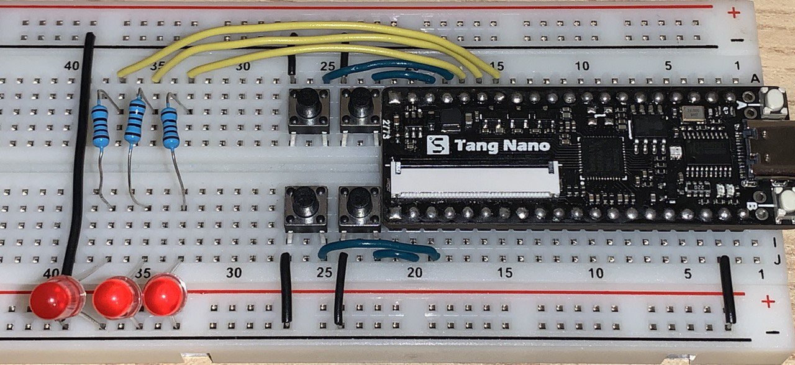

# Tang Nano Example

Repository: <https://github.com/E4tHam/tangnano_example>

---

## About

The Tang Nano is the famous / infamous $5 FPGA ([learn more here](https://tangnano.sipeed.com/en/)). This repository is a simple example of how to get started with the Tang Nano with FuseSoC.

This repository is an implementation of a sequential adder. 

## Usage

```bash
make load       # load the bitstream to the Tang Nano
make tinyfpga   # generate the bitstream

make sim        # simulate the testbench
make view       # open dump in gtkwave

make clean      # remove build files
```

## Requirements

* [FuseSoC](https://fusesoc.readthedocs.io/en/stable/user/installation.html)
* [Icarus Verilog](https://iverilog.fandom.com/wiki/Installation_Guide)
* [GTKWave](http://gtkwave.sourceforge.net/)
* [Apicula](https://github.com/YosysHQ/apicula#getting-started)
* [yosys](https://github.com/yosyshq/yosys#setup)
* [nextpnr-gowin](https://github.com/YosysHQ/nextpnr#nextpnr-gowin)
* [openFPGALoader](https://github.com/trabucayre/openFPGALoader/blob/master/INSTALL.md#installing-openfpgaloader)

Note: As of 9/12/21, [Edalize](https://github.com/olofk/edalize/) has a bug with the Apicula toolchain. To fix it, after installing FuseSoC, manually add [this Makefile template](https://github.com/infphyny/edalize-1/blob/master/edalize/templates/apicula/apicula-makefile.j2) to "`${YOUR_EDALIZE_INSTALL_DIR}/templates/apicula/apicula-makefile.j2`".
